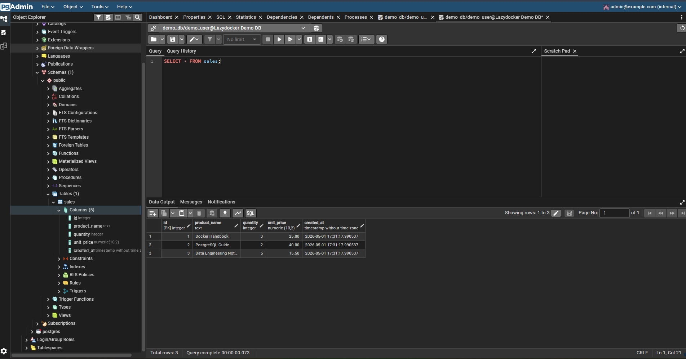
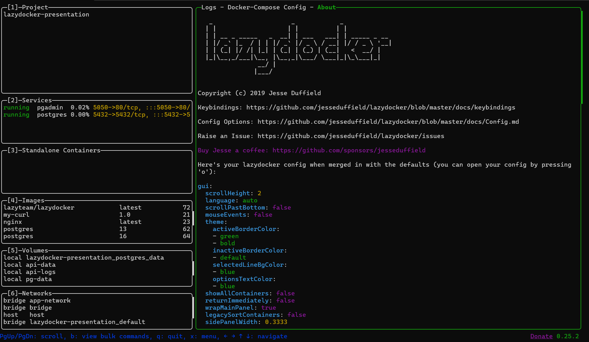

# Lazydocker 

This repository was prepared for the YZV322E Applied Data Engineering individual tool presentation assignment.

The selected tool is **Lazydocker**, a terminal UI for managing Docker and Docker Compose environments.

## 1. What is Lazydocker?

Lazydocker is a lightweight terminal user interface for Docker and Docker Compose. It allows developers to inspect containers, images, volumes, logs, and resource usage from a single keyboard-driven interface.

Instead of repeatedly typing Docker CLI commands such as `docker ps`, `docker logs`, `docker restart`, or `docker compose`, Lazydocker provides an interactive terminal dashboard for common Docker operations.

## 2. Course Connection

This demo is connected to the following course tools and topics:

- Docker
- Docker Compose
- PostgreSQL
- pgAdmin
- Container logs
- Container lifecycle management

The demo uses Docker Compose to run a small PostgreSQL + pgAdmin stack. Lazydocker is then used to inspect and manage the running containers.

## 3. Prerequisites

The following software is required:

- Windows, macOS, or Linux
- Docker Desktop or Docker Engine
- Docker Compose
    - Docker >= 29.0.0 (API >= 1.24)
    - Docker-Compose >= 1.23.2 (optional)
- Lazydocker
- A web browser

For Windows, Lazydocker can be installed with:

```powershell
winget install jesseduffield.lazydocker
```

For macOS:

```bash
brew install jesseduffield/lazydocker/lazydocker
```

For Linux:

```bash
curl https://raw.githubusercontent.com/jesseduffield/lazydocker/master/scripts/install_script.sh | bash
```

Check that Docker and Lazydocker are available:

```bash
docker --version
docker compose version
lazydocker --version
```

## 4. Installation and Setup

Clone the repository:

```bash
git clone https://github.com/selimozel03/lazydocker-presentation.git
cd lazydocker-presentation
```

On Windows, make sure Docker Desktop is open and the engine is running before proceeding.

Start the demo environment:

```bash
docker compose up -d
```

Check that the containers are running:

```bash
docker ps
```

Expected containers:

```text
lazydocker-demo-postgres
lazydocker-demo-pgadmin
```

## 5. Running the Example

Open pgAdmin in a browser:

```text
http://localhost:5050
```

Login credentials:

```text
Email: admin@example.com
Password: admin123
```

Register the PostgreSQL server in pgAdmin.

General tab:

```text
Name: Lazydocker Demo DB
```

Connection tab:

```text
Host name/address: postgres
Port: 5432
Maintenance database: demo_db
Username: demo_user
Password: demo_password
```

After connecting, open the Query Tool and run:

```sql
SELECT * FROM sales;
```

Expected output should include:

```text
Docker Handbook
PostgreSQL Guide
Data Engineering Notes
```

## 6. Using Lazydocker

After the Docker Compose stack is running, open Lazydocker:

```bash
lazydocker
```

In the Lazydocker interface, inspect the following containers:

```text
lazydocker-demo-postgres
lazydocker-demo-pgadmin
```

Suggested demo actions:

1. Show the running PostgreSQL and pgAdmin containers.
2. Open the logs panel for the PostgreSQL container.
3. Open the logs panel for the pgAdmin container.
4. Restart the pgAdmin container.
5. Confirm that the container becomes running again.
6. Show container resource usage.
7. Explain how Lazydocker reduces the need to memorize Docker CLI commands.

## 7. Stopping the Demo

Stop and remove the containers:

```bash
docker compose down
```

Stop and remove containers, networks, and volumes:

```bash
docker compose down -v
```

Use `docker compose down -v` only if you want to reset the PostgreSQL database volume.

## 8. Expected Output

The demo creates a PostgreSQL database named `demo_db` with a `sales` table.

The expected query result from:

```sql
SELECT * FROM sales;
```

should include the following rows:

```text
Docker Handbook
PostgreSQL Guide
Data Engineering Notes
```

**pgAdmin — query output:**



**Lazydocker — container overview:**



## 9. Files in This Repository

- `docker-compose.yml`: Defines the PostgreSQL and pgAdmin services.
- `init.sql`: Initializes the demo database, table, sample data, and view.
- `screenshots/`: Contains expected output screenshots.
- `slides/`: Contains the presentation slide deck.

## 10. AI Usage Disclosure

The following AI tools were used during the preparation of this project:

- **ChatGPT** — used to generate an initial draft of the presentation slide structure and content.
- **Claude** — used to assist with README structure, wording, and reviewing the docker-compose.yml and init.sql files for correctness.

All AI-generated content was reviewed, tested, and verified by me before inclusion. The Docker Compose setup, SQL scripts, and demo steps were run and confirmed to work on my local machine.


## 11. References

- Lazydocker GitHub repository: https://github.com/jesseduffield/lazydocker
- Docker documentation: https://docs.docker.com/
- PostgreSQL Docker image: https://hub.docker.com/_/postgres
- pgAdmin Docker image documentation: https://hub.docker.com/r/dpage/pgadmin4/